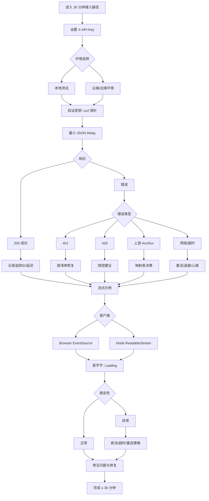

# codex-relay UI/UX Specification

## Introduction
This document defines the user experience goals, information architecture, user flows, and visual design specifications for codex-relay's user interface. It serves as the foundation for visual design and frontend development, ensuring a cohesive and user-centered experience.

Notes and rationale:
- Focus on MVP priorities: reliable relay, SSE streaming, fixed egress IP policy, unified error model, and a "30-minute onboarding" path.
- Emphasize information architecture and critical interaction feedback over heavy visual design at this stage.

---

## Overall UX Goals & Principles

### Target User Personas
- Power User (技术向集成者): 熟悉 HTTP/SDK，追求高可靠与低时延；需求：快速接入、统一错误模型映射、流式示例、可观测指标参考。
- Casual User（轻量使用者/学生/研究者）: 依赖现成示例与错误提示；需求：极简“30 分钟接入路径”、清晰鉴权/超限提示。
- Administrator（租户/运维管理者）: 关注密钥生命周期、配额/并发、用量观测与合规；需求：查看/禁用/旋转 API Key、用量摘要、排查清单。

### Usability Goals
- Ease of learning: 30 分钟内完成鉴权、首个 JSON 调用与流式示例。
- Efficiency of use: 常用调用路径 ≤ 3 步；流式示例复制即用。
- Error prevention: 统一错误模型 + 清晰提示（鉴权失败、超限、上游错误分类）。
- Memorability: 文档导航一致，回访 1 分钟内定位“接入路径/示例/排查”。

### Design Principles
1. Clarity over cleverness — 文案/结构清晰，优先可执行性。
2. Progressive disclosure — 先最小可用，再按需展开高级策略。
3. Consistent patterns — 错误提示/示例结构统一，导航模板一致。
4. Immediate feedback — 鉴权/超限/流式状态即时反馈，首字节可观测。
5. Accessible by default — 默认满足基础可达性。

---

## Information Architecture (IA)

### Site Map / Screen Inventory

```mermaid
graph TD
    A[Docs Home] --> B[Getting Started]
    A --> C[30 分钟接入路径]
    A --> D[API 参考]
    A --> E[错误模型与排查]
    A --> F[流式（SSE/Chunk）示例]
    A --> G[常见问题 FAQ]
    A --> H[架构与约束]

    B --> B1[环境与密钥准备]
    B --> B2[curl/SDK 最小调用]
    B --> B3[部署与回滚提示]

    C --> C1[设置 X-API-Key]
    C --> C2[最小 JSON Relay]
    C --> C3[流式读取示例]
    C --> C4[常见错误与修复]

    D --> D1[同步 JSON 调用]
    D --> D2[流式事件]
    D --> D3[请求头规范与安全策略]
    D --> D4[错误码与追踪 ID 约定]

    E --> E1[鉴权失败]
    E --> E2[超限/并发限制]
    E --> E3[上游 4xx/5xx 映射]
    E --> E4[断流/超时/重连策略]

    F --> F1[浏览器 EventSource 示例]
    F --> F2[Node ReadableStream 示例]
    F --> F3[首字节与回压说明]

    H --> H1[系统分层]
    H --> H2[仅记录元数据]
    H --> H3[地域/固定出口 IP]

    Z[未来：最小控制台] --> Z1[租户与 API Keys]
    Z --> Z2[用量与延迟摘要]
    Z --> Z3[配额与并发设置]
    Z --> Z4[区域路由提示/策略]
```


### Navigation Structure
- Primary: Getting Started / 30 分钟接入路径 / API 参考 / 错误模型与排查 / 流式示例 / 架构与约束 / FAQ
- Secondary: 
  - API 参考: 同步 JSON / 流式事件 / 请求头规范 / 错误码与追踪 ID
  - 30 分钟接入: 设置 X-API-Key / 最小 JSON / 流式读取 / 常见错误
- Breadcrumbs: Docs Home > 一级导航 > 二级子项

---

## User Flows

### Flow 1: 30 分钟接入路径
- Goal: 30 分钟内完成密钥配置、最小 JSON、流式示例、常见错误修复。
- Diagram:


### Flow 2: 同步 JSON 调用
- Goal: 同步方式转发 JSON 并获得统一错误模型与可观测元数据。
- Diagram:
```mermaid
graph TD
    A[准备请求与 headers] --> B[附加 X-API-Key]
    B --> C[POST /relay/json]
    C --> D{上游响应}
    D --> D1[200 JSON]
    D --> D2[错误]
    D1 --> E[解析响应, 记录追踪ID]
    E --> F[记录延迟/指标]
    D2 --> G{错误类型}
    G --> G1[401]
    G --> G2[429]
    G --> G3[上游 4xx/5xx]
    G --> G4[网络/超时]
    G1 --> H1[鉴权修复]
    G2 --> H2[频控建议]
    G3 --> H3[映射与可恢复性]
    G4 --> H4[重试/退避策略]
    H1 --> I[重试]
    H2 --> I
    H3 --> I
    H4 --> I
    I --> J{结果}
    J --> J1[成功闭环]
    J --> J2[进一步排查(追踪ID)]
```

### Flow 3: 流式消费（SSE/Chunk）
- Goal: 稳定、低延迟地消费增量数据；异常下可预测恢复。
- Diagram:
```mermaid
graph TD
    A[选择客户端] --> B{Browser or Node}
    B --> B1[EventSource]
    B --> B2[Fetch + ReadableStream]
    B1 --> C1[构建 URL 与 headers]
    B2 --> C2[发起 fetch 获取流]
    C1 --> D[等待首字节: Loading]
    C2 --> D
    D --> E{事件流消费}
    E --> E1[正常事件]
    E --> E2[错误/断流]
    E1 --> F[渲染增量, 节流/缓冲]
    F --> G[记录事件间隔/吞吐]
    E2 --> H{错误分类}
    H --> H1[可恢复/不可恢复]
    H --> H2[网络/超时/断线]
    H --> H3[编码/分帧异常]
    H1 --> I1[限次重试(退避)]
    H1 --> I2[不可恢复: 提示+追踪ID]
    H2 --> I3[重连策略: 上限+回退]
    H3 --> I4[容错解析或终止]
    I1 --> J[结束]
    I2 --> J
    I3 --> J
    I4 --> J
    J --> K[总结与排查链接]
```

---

## Wireframes & Mockups
- Design tool: Figma（占位），单文件多 Page（IA & Flows / Wireframes / Components / States & Errors / Handoff）。
- 关键页面：Docs Home、30 分钟接入路径、API 同步 JSON、错误模型与排查、流式示例（Browser/Node 两 Tab）。

---

## Component Library / Design System
- Approach: 轻量自建 + 借鉴成熟可达模式（Radix 交互语义、ARIA）。
- 工具建议：TailwindCSS；设计令牌最小集（颜色/间距/圆角/阴影/排版）。
- Core components: Button, Alert/Callout, Card, Tabs, Accordion, Breadcrumbs, Code Block with Copy, Table, Tooltip/Popover, Toast, Badge/Label, Skeleton/Progress。
- 可达性基线：焦点可见、对比达标、键盘导航、非色彩编码、动效可控。

---

## Branding & Style Guide
- Visual Identity: MVP 阶段字标 + 令牌；后续完善 Logo 与品牌手册。
- Color Palette: Primary #2563EB, Secondary #64748B, Accent #22C55E, Success #16A34A, Warning #F59E0B, Error #DC2626, Neutral 阶梯。
- Typography: Inter（Primary）、JetBrains Mono（代码）；H1 32/1.25、H2 24/1.3、H3 20/1.4、Body 16/1.6、Small 14/1.6。
- Iconography: Lucide/Heroicons；与文本大小与间距规则一致。
- Spacing & Layout: 12 列网格，内容最大宽度 960-1200px；间距刻度 4-64。

---

## Accessibility Requirements
- Target: WCAG 2.2 AA；覆盖文档站、关键组件、错误与排查页面。
- Visual/Interaction/Content 要求：对比度、焦点指示、键盘导航、替代文本、标题层级、表格关联、代码块辅助。
- Testing: axe/pa11y 自动化 + 手动键盘走查 + 屏幕阅读器检查；回归基线与文档化。

---

## Responsiveness Strategy
- Breakpoints: Mobile (320-639), Tablet (640-1023), Desktop (1024-1439), Wide (≥1440)。
- Adaptation: 布局（单列/双列/TOC 固定）、导航（汉堡/精简面包屑/下拉 Tabs）、内容优先级（示例先行、折叠高级参数）、交互（触控目标≥44px、Toast 不遮挡代码）。

---

## Animation & Micro-interactions

### Motion Principles
- 简洁克制（Subtle over Showy）：以信息传达为第一优先，避免喧宾夺主。
- 指向性（Directional Cues）：用于暗示层级/来源/状态变化（进入/退出、展开/收起、Tabs 切换）。
- 一致性（Consistent Easing & Duration）：统一缓动与时长，形成肌肉记忆。
- 可达性优先（Respect Reduced Motion）：尊重 `prefers-reduced-motion`，退化为淡入淡出或直接跳变。
- 性能友好（GPU-friendly）：优先使用 `transform/opacity`，避免重排与抖动。

建议全局参数：
- 时长：进入/退出 160–220ms；展开/收起 180–220ms；Toast/反馈 120–160ms。
- 缓动：进入 `cubic-bezier(0.2, 0.8, 0.2, 1)`；退出 `cubic-bezier(0.4, 0.0, 1, 1)`；强调（谨慎）`cubic-bezier(0.34, 1.56, 0.64, 1)`。

### Key Animations
- Tabs 切换（Browser/Node）：内容淡入（160ms），下划线滑动指示（~180ms）。
- Accordion 展开/收起：高度自动 + 内容淡入（180–220ms），避免频繁 reflow。
- 复制按钮反馈：图标切换 + 轻微缩放（120ms）+ Toast 淡入淡出；朗读“已复制”。
- Toast 出现/消失：上移 4–8px + 淡入（160ms），2–3s 自动消失；避免遮挡代码块。
- Callout/Alert 强调：阴影/边框颜色短促过渡（120–160ms），颜色+图标+文案三要素。
- 面包屑/TOC 高亮更新：平滑颜色/下划线过渡（120ms），不改变布局。
- 骨架屏/进度：低对比 shimmer，`prefers-reduced-motion` 时关闭。
- 流式示例首字节→增量事件：Loading 渐隐；事件批量淡入并节流渲染。

论证：以“信息与状态”为核心的最小有效动画，统一参数减少认知负担；兼顾 `prefers-reduced-motion` 与 GPU 友好策略，提升性能与可达性。

---

## Performance Considerations

### Performance Goals
- 页面加载：首屏可交互（TTI）尽可能短，示例页优先按需加载。
- 交互响应：常见交互（复制、Tabs、Accordion）< 100ms 反馈。
- 动效帧率：动画稳定 60 FPS（退化场景不少于 30 FPS）。

### Design Strategies
- 渲染与布局：控制内容最大宽度（≤ 1200–1280px），避免超长行带来回流成本。
- 代码示例：按需加载高亮脚本；大块示例懒加载/折叠。
- 图片与图标：优先 SVG 与矢量；位图使用响应式尺寸与压缩。
- 动效实现：使用 `transform/opacity`，避免逐帧改变 `top/left/height` 等属性。
- 事件节流：流式日志/事件渲染采用节流/批处理，减少主线程压力。
- 依赖与样式：Tailwind 原子类减少自定义 CSS 体积；去除未用样式（Purge）。
- 可观测性：在示例中打印追踪 ID 与关键时序，辅助性能与故障排查。

---

## Next Steps

### Immediate Actions
1. 整理并发布文档 IA 结构（Docs Home/30 分钟接入路径/API 参考/错误与排查/流式示例/架构与约束/FAQ）。
2. 补齐“30 分钟接入路径”完整示例（curl/JS/TS）与截图，提供一键复制与预期结果说明。
3. 编写“错误模型与排查”四类错误的示例与修复清单（401/429/上游映射/断流超时）。
4. 输出 Browser EventSource 与 Node ReadableStream 的最小流式示例，打印追踪 ID/重连次数/事件间隔。
5. 组件库落地最小集（Button/Tabs/Accordion/Code Copy/Toast/Callout/Breadcrumbs），实现可达性基线。
6. 配置可达性与性能检查（axe/pa11y + 基础 Lighthouse），生成基线报告。
7. 在仓库添加 `docs/brand/` 目录与基础令牌（颜色/排版/间距），后续补充 Logo 与规范。

### Design Handoff Checklist
- [ ] 所有用户流程（Flow 1/2/3）已在文档中落地（Mermaid 图与说明）
- [ ] 组件清单与可达性基线已实现（焦点可见/对比度/键盘导航）
- [ ] “错误模型与排查”四类错误均有示例与修复步骤
- [ ] “30 分钟接入路径”具备可复制示例与预期结果截图
- [ ] 流式示例可观测首字节、事件间隔、重连次数
- [ ] 响应式策略在主要断点通过走查（Mobile/Tablet/Desktop/Wide）
- [ ] 动效参数统一并尊重 prefers-reduced-motion

---

## Checklist Results

说明：若存在正式的 UI/UX 检查清单，则在此执行并记录结果；当前版本暂未引入独立清单，建议在完成组件与页面初版后，使用以下最小清单进行一次走查：

最小走查清单（建议）
- [ ] 焦点可见：通过键盘 Tab 覆盖页面所有交互元素
- [ ] 对比度达标：正文/按钮/链接/警示卡片通过 AA
- [ ] 复制按钮：键盘可触发，Toast 不遮挡代码
- [ ] Tabs/Accordion：ARIA 语义正确，键盘可用
- [ ] 错误卡片：颜色+图标+文本三要素，明确修复步骤
- [ ] 流式示例：显示追踪 ID 与异常处理提示
- [ ] 移动端：目录折叠，示例与表格可用水平滚动

> 注：后续若引入正式 UI/UX 检查清单或自动化脚本，请将结果链接/报告附于本节。
